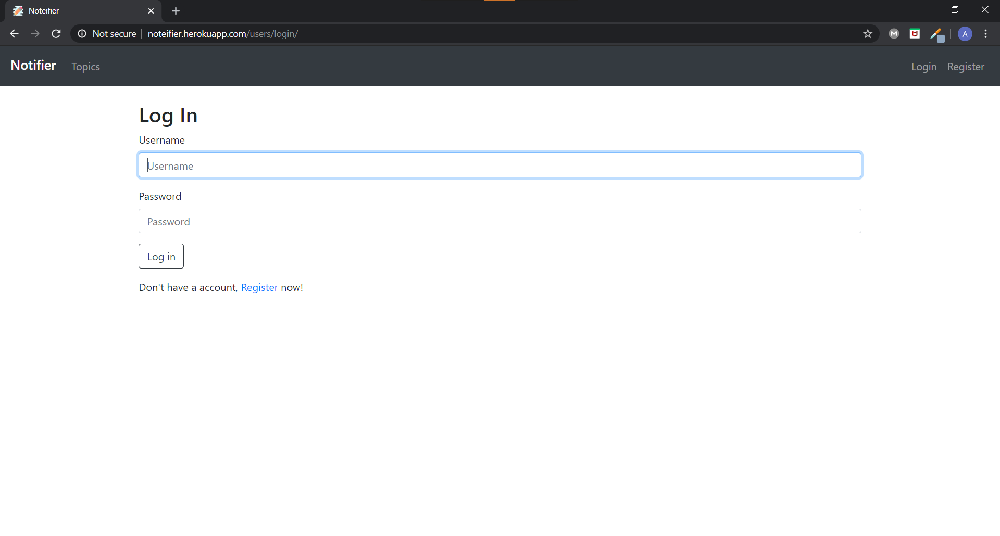

# Noteifier
A django app to write notes built for learning purposes. 

## End User Instruction

The app is hosted at http://noteifier.herokuapp.com/. Register and start using it now!

### Features

* Register/Login to personalize notes
* Add/Delete Topics to group your notes
* Add/Edit/Delete notes taken

### Screenshots
Screenshots are inside the images directory. Here are a couple of them!

## Developer Instruction

Feel free to fork the repo and develop an app taking this as the base.

### Instructions for local deployment

* Fork the repo into your account.
* Clone the repo present in your account into your local machine.
* Navigate to the folder `Noteifier/` or whatever you named your fork.
* Migrate the database. `python manage.py migrate`
* Run the server `python manage.py runserver`. Choose a different port if `8000` is already occupied.
* Visit `localhost:8000` to view the app. If you used a different port no. use that instead.
* You can now tweak the source code to your choice.
